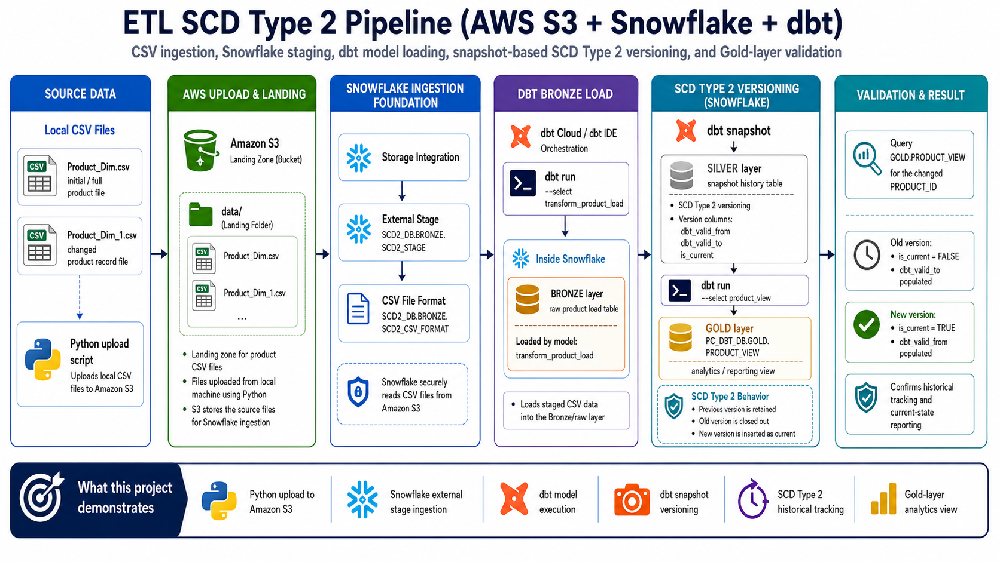

# Architecture Overview

## Project Architecture

This project demonstrates an SCD Type 2 product-dimension pipeline using AWS S3, Snowflake, dbt models, and dbt snapshots.

The goal is to load product data from CSV files, transform it into a Snowflake warehouse structure, and preserve historical product changes over time.

## Architecture Diagram



## High-Level Flow

```text
Local Product CSV files
→ Python upload script
→ Amazon S3 raw_data/ folder
→ Snowflake storage integration
→ Snowflake external stage
→ BRONZE.WORK_PRODUCT_COPY
→ dbt Silver transform model
→ dbt Snapshot table
→ dbt Gold product history view
```

## What Happens Where

| Layer / Tool | Location | Purpose |
|---|---|---|
| Local CSV files | Local machine | Initial and changed product data files |
| Python upload script | Local machine | Uploads product CSV files to S3 |
| Amazon S3 | AWS | Stores raw product CSV files in the `raw_data/` folder |
| Storage integration | Snowflake | Allows Snowflake to securely read files from S3 |
| External stage | Snowflake | Points Snowflake to the S3 file location |
| Bronze table | Snowflake | Stores copied raw product rows from staged CSV files |
| dbt Silver model | dbt + Snowflake | Creates a transformed product table |
| dbt Snapshot | dbt + Snowflake | Tracks historical changes for selected product fields |
| dbt Gold view | dbt + Snowflake | Exposes product version history for validation and reporting |

## Main Data Flow

### 1. Local Product Files

The project starts with two local CSV files:

```text
Product_Dim.csv
Product_Dim_1.csv
```

`Product_Dim.csv` is the initial product dataset.

`Product_Dim_1.csv` contains a changed product record used to demonstrate SCD Type 2 versioning.

These files are stored locally under:

```text
data/local/
```

They are intentionally excluded from GitHub.

## 2. Python Upload to S3

The Python script uploads product CSV files to Amazon S3.

Script:

```text
python/local_to_aws_s3.py
```

Target S3 location:

```text
s3://scd2-product-data-jenny/raw_data/
```

The script uses `boto3` and a local AWS CLI profile instead of hardcoding credentials.

## 3. AWS S3 Landing Zone

S3 acts as the raw file landing zone.

Files uploaded to S3 are available for Snowflake ingestion through the external stage.

S3 does not transform the data. It only stores the raw product CSV files before Snowflake reads them.

## 4. Snowflake Storage Integration

The storage integration allows Snowflake to securely access the S3 bucket.

Integration:

```text
SCD2_INT
```

This uses an AWS IAM role and Snowflake-generated trust values to allow Snowflake to read files from the S3 `raw_data/` folder.

## 5. Snowflake External Stage

The external stage points Snowflake to the S3 folder.

Stage:

```text
SCD2_DB.BRONZE.SCD2_STAGE
```

S3 path:

```text
s3://scd2-product-data-jenny/raw_data/
```

A successful `LS` command against the stage proves Snowflake can see the staged product file.

## 6. Bronze Working Table

The Bronze table stores the copied product data from the staged CSV file.

Table:

```text
SCD2_DB.BRONZE.WORK_PRODUCT_COPY
```

This table is loaded by a dbt macro that runs a Snowflake `COPY INTO` command.

The Bronze layer is close to the raw source file structure, but it also adds metadata fields such as:

```text
INSERT_DTS
UPDATE_DTS
SOURCE_FILE_NAME
SOURCE_FILE_ROW_NUMBER
```

## 7. dbt Macro

The dbt macro handles the reusable load step from Snowflake stage to Bronze table.

Macro file:

```text
dbt/macros/copy_into_snowflake.sql
```

Macro name:

```text
scd2_copy_product_csv
```

The macro:

1. Clears the Bronze working table.
2. Reads the staged CSV file.
3. Copies product rows into `WORK_PRODUCT_COPY`.
4. Adds load timestamps and file metadata.

This macro is called as a `pre_hook` before the Silver model runs.

## 8. dbt Silver Transform Model

The Silver model transforms the Bronze product copy table into a cleaner working product table.

Model:

```text
dbt/models/scd2_product/silver/transform_product_load.sql
```

Output table:

```text
SCD2_DB.SILVER.WORK_PRODUCT_TRANSFORM
```

This layer keeps product attributes and adds processing metadata such as:

```text
TIME_ZONE
SOURCE_SYS_NAME
INSTNC_ST_NM
PROCESS_ID
PROCESS_NAME
```

## 9. dbt Snapshot

The dbt snapshot is the core SCD Type 2 component.

Snapshot file:

```text
dbt/snapshots/scd2_product/product_snapshot.sql
```

Snapshot table:

```text
SCD2_DB.SNAPSHOTS.PRODUCT_SNAPSHOT
```

The snapshot tracks product changes using:

```text
unique_key = PRODUCT_ID
strategy = check
```

The `check` strategy means dbt compares selected columns to determine whether a product changed.

Tracked columns include:

```text
PRODUCT_NAME
CATEGORY
SELLING_PRICE
MODEL_NUMBER
ABOUT_PRODUCT
PRODUCT_SPECIFICATION
TECHNICAL_DETAILS
SHIPPING_WEIGHT
PRODUCT_DIMENSIONS
```

When one of these fields changes, dbt:

1. Expires the old product version.
2. Creates a new current product version.
3. Updates validity timestamps.

dbt adds metadata columns such as:

```text
DBT_SCD_ID
DBT_UPDATED_AT
DBT_VALID_FROM
DBT_VALID_TO
```

## 10. dbt Gold View

The Gold view exposes the product snapshot history in a reporting-friendly format.

Model:

```text
dbt/models/scd2_product/gold/product_view.sql
```

Output view:

```text
SCD2_DB.GOLD.PRODUCT_VIEW
```

The Gold view renames dbt validity fields into clearer business-style names:

```text
DBT_VALID_FROM → VRSN_STRT_DTS
DBT_VALID_TO   → VRSN_END_DTS
```

For current rows, the view uses an open-ended date:

```text
9999-12-31
```

This makes it easier to identify the active/current product version.

## SCD Type 2 Behavior

SCD Type 2 preserves history.

In this project, the changed product file updated two fields for the same product ID:

```text
PRODUCT_ID: 4c69b61db1fc16e7013b43fc926e502d
MODEL_NUMBER: blank → BG1782
PRODUCT_DIMENSIONS: blank → 41" H x 36" W x 24" L
```

After rerunning the transform, snapshot, and Gold view, Snowflake showed two versions of that product:

| Version | Meaning |
|---|---|
| Old version | Retained for history and given an end timestamp |
| New version | Inserted as the current active version |

## Why This Architecture Matters

This architecture separates responsibilities clearly:

| Component | Responsibility |
|---|---|
| Python | Upload files from local machine to S3 |
| S3 | Store raw product files |
| Snowflake stage | Expose S3 files to Snowflake |
| Bronze table | Store copied raw product data |
| Silver model | Transform product data for modeling |
| dbt snapshot | Track historical changes |
| Gold view | Present versioned product history |

This pattern is useful when a team needs to preserve historical changes to dimension records instead of only keeping the latest values.